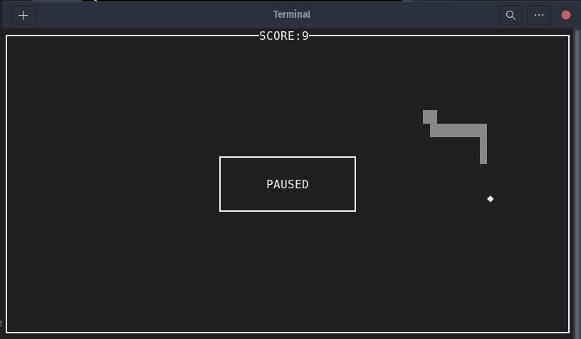

# SNAKE #




This is a simple snake game for the terminal made in C and using NCurses.

## Requirements: ##
- NCurses library.

## Compile and run: ##

```bash
$ make
$ ./snake
```
## Clean: ##

```bash
$ make clean
```

## Controls: ##

<kbd>↑</kbd>: Move snake up

<kbd>↓</kbd>: Move snake down

<kbd>←</kbd>: Move snake left

<kbd>→</kbd>: Move snake right

<kbd>p</kbd>: Pause

<kbd>q</kbd>: Quit

## TODO: ##

- Add menu
- Save score
- High-score table